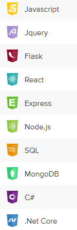
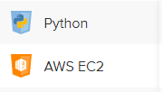

### Hello. Thank you for stopping by! 👋

<table>
  <tr>
    <td style="width:50%">
      <h1>About Me:</h1>
      <ul>
        <li>Name: Susan Zhou</li>
        <li>Active Projects:
          <ol>Learning Unity</ol>
          <ol>Learning Django</ol>
          <ol>Learning PostgresSQL</ol>
          <ol>Learning awesome Data structures and algos</ol>
        </li>
        <li> Volunteering:
            <ol>Form's logic</ol>
            <ol>Digital Media platform and Game Development<ol>
        </li>
      </ul>
        <li>
          
I am currently Seeking Work!

          
Interested In: Game Development, Full Stack Software Development, Full Stack Software Engineer, Frontend, Backend 

        </li>  
        <li>Hobbies:
          <ol>Games</ol>
          <ol>Writing</ol>
          <ol>Traveling</ol>
          <ol>Cooking</ol>
          <ol>Yoga</ol>
        </li>
        
 Want to reach out? Hit me up with an email or direct message!

        
<a href="https://docs.google.com/document/d/1vDXX8sdND-fvmLXkz146QooeS5wVexFh/edit?usp=sharing&ouid=110299049554834787930&rtpof=true&sd=true" class="link" target="_blank">Resume

    </td>
     <td style="width:50%">
     <h1>Tech Skills:</h1>
        
        
    </td>
  </tr>
</table>

<h2>
  Nope | <a href="https://github.com/ZhouSusan/Nope">Repo</a>
</h2>
<table>
  <tr>
    <td style="width:50%">
      <ul>
        <li>Promtional Gaming Websites with Charcters Video</li>
        <li>MySQL for data persistence  </li>
        <li>Email and form validations</li>
        <li>Automatic email with mailing subscriptions</li>
      </ul>
    </td>
    <td style="width:50%">
        
    </td>
  </tr>
</table>

<h2>
  Global ATM | <a href="https://github.com/ZhouSusan/GlobalATM-new">Repo</a>
</h2>
<table>
  <tr>
    <td style="width:50%">
      <ul>
        <li>C# ATM project with class inheritance (Accounts -- Savings vs. Checking)</li>
        <li>Login / Registration with hashed passwords and validations</li>
        <li>Security Questions mapped to account for lost / stolen card account recovery</li>
        <li>Currency Exchange API for rapid exchange rates / conversions</li>
      </ul>
    </td>
    <td style="width:50%">
        
    </td>
  </tr>
</table>

<h2>
  Project Manager | <a href="https://github.com/ZhouSusan/MERN_ProjectManager">Repo</a>
</h2>
<table>
  <tr>
    <td style="width:50%">
      <ul>
        <li>A full-stack remote learning management system web application </li>
        <li>Many to many relationships with MongoDB</li>
        <li>Developed and implemented CRUD operations for Create Class functionality</li>
        <li>Login / Registration with authentication</li>
      </ul>
    </td>
    <td style="width:50%">
        
    </td>
  </tr>
</table>

<h2>
  Wedding Planner | <a href="https://github.com/ZhouSusan/WeddingPlanningWithC-">Repo</a>
</h2>
<table>
  <tr>
    <td style="width:50%">
      <ul>
        <li>C# Wedding Planner application that allows registered users to plan a wedding. Users can RSVP to weddings and view attendee lists.</li>
        <li>Login / Registration with hashed passwords and validations</li>
        <li> Many-to-many SQL tables/Entity Framework models</li>
        <li>ntegrate Google Maps API to display map for Wedding's address with autocompletion</li>
      </ul>
    </td>
    <td style="width:50%">
        
    </td>
  </tr>
</table>
